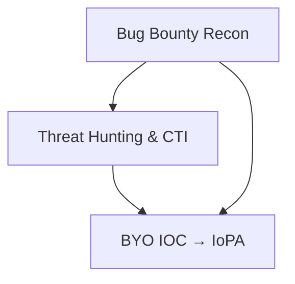

# Malanta Pre-Attack Prevention - Community APIs

> **Malanta mission:** *Pre-Attack Prevention.*  
> **What this is:** A set of REST APIs that help security researchers, threat hunters, and bug bounty practitioners uncover an organization’s public-facing digital assets and identify a limited set of exposure types related to them.

Malanta for the community provides **programmatic access** to company's digital assets and exposure indicators that often feature in responsible disclosure and bug bounty workflows. It’s designed to **augment** your recon and enrichment pipelines, not to replace verification, triage, or vendor disclosure processes.

---

## Table of Contents

- [Who Is This For?](#who-is-this-for)
- [Use Cases](#use-cases)
- [Scripts Overview](#scripts-overview)
  - [1. Bug Bounty Recon](#1-bug-bounty-recon)
  - [2. Threat Hunting & CTI](#2-threat-hunting--cti)
  - [3. BYO IOC → IoPA](#3-byo-ioc--iopa)
- [Ethics, Scope & Responsible Use](#ethics-scope--responsible-use)
- [Get Access](#get-access)
- [Rate Limiting](#rate-limiting)
- [Safety, Legal, and Disclosure](#safety-legal-and-disclosure)
- [Mappings & Frameworks](#mappings--frameworks)
- [FAQ](#faq)
- [Support](#support)
- [License](#license)


## Who Is This For?

- **Security Researchers & Bug Bounty Hunters** - expand recon and validate publicly visible risks.
- **Threat Hunters & DFIR** - enrich investigations with domain and subdomain context.
- **CTI & Exposure Management** - monitor asset drift and third-party footprint changes.

---
## Use Cases

- **Bug bounty reconnaissance**: map external assets, detect likely takeover conditions, and gather supporting evidence.  
- **Threat hunting & CTI**: pivot on registrar, nameserver, vendor, and creation timelines to spot suspicious asset sprawl.  
- **Exposure management**: track subdomain drift across cloud vendors and third-party services.
- **Bring Your Own IOC**: uncover indicators-of-pre-attack associated with an IOC.


> **malanta.ai value:** We focus on the **pre-attack surface**-signals that precede exploitation, so you can mitigate **before** attackers operationalize.
> [malanta.ai's API Endpoints documentation](https://docs.api.malanta.ai).

---


## Scripts Overview

Below are three example Python scripts provided for the community. Each illustrates a key pre-attack prevention workflow.


- **Bug Bounty Recon:** Map an organization’s external assets, detect takeover conditions, and gather supporting evidence.  
- **Threat Hunting & CTI:** Pivot by registrar, nameserver, and timeline to spot suspicious asset sprawl.  
- **BYO IOC → IoPA:** Expand an IOC (domain/IP/email) to uncover indicators-of-pre-attack.

### 1. Bug Bounty Recon
This script maps an organization’s external assets by discovering domains and subdomains, highlights likely subdomain takeover conditions, and gathers supporting evidence such as DNS records, certificate exposures, and IP ranges. It is designed to help bug bounty researchers quickly expand scope and spot misconfigurations or vulnerable infrastructure.

**Usage:**
```bash
export MALANTA_API_KEY="YOUR_KEY"
python3 bug_bounty_recon_example.py --company "Example Ltd." --out example_recon.json
```

**Sample Response (trimmed):**
```json
{
  "company": "Example Ltd.",
  "domain_count": 5,
  "domains": [
    {
      "domain": "example.com",
      "subdomain_count": 42,
      "dns_sample": [{"record_type": "A", "record_value": "81.196.34.201"}],
      "cert_exposure_sample": [{"Domain": "example.com", "FQDN": "academy.example.com"}],
      "takeover_company_sample": [{"FQDN": "apifiles.acme.com", "Status": "MISMATCH DETECTED"}]
    }
  ]
}
```

### 2. Threat Hunting & CTI
This script pivots on registrar information, nameserver providers, and domain creation/update timelines to uncover suspicious infrastructure changes and asset sprawl. It helps CTI analysts and threat hunters detect drift in domain management, registrar anomalies, and vendor sprawl that may indicate weak points in an organization’s attack surface.

**Usage:**
```bash
export MALANTA_API_KEY="YOUR_KEY"
python3 threat_hunting_cti_example.py --company "Example Ltd." --out example_cti.json
```

**Sample Response (trimmed):**
```json
{
  "company": "Example Ltd.",
  "domain_count": 5,
  "domains": [
    {
      "domain": "example.com",
      "whois_latest": {"registrar": "GoDaddy.com LLC", "create_date": "2002-04-03"},
      "whois_history_stats": {"registrar_changes": [], "nameserver_changes": []},
      "vendor_inference": {"from_nameservers": ["cloudflare"]},
      "sprawl_indicators": {"non_preferred_registrar": true, "vendors": ["cloudflare"]}
    }
  ]
}
```

### 3. BYO IOC → IoPA
This script expands a given IOC (domain, IP, or email) into Indicators-of-Pre-Attack (IoPA). It pivots through DNS records, certificate Subject CNs, and Malanta clustering to uncover related domains, IPs, and emails. The result is a broader set of infrastructure artifacts associated with pre-attack activities, useful for enrichment, hunting, and CTI correlation.

**Usage:**
```bash
export MALANTA_API_KEY="YOUR_KEY"
python3 byo_ioc_iopa_example.py --domain bad.tld --ip 203.0.113.10 --out iopa.json
```

**Sample Response (trimmed):**
```json
{
  "seeds": {"domains": ["bad.tld"], "ips": ["203.0.113.10"], "emails": []},
  "expanded": {"domains": ["bad.tld", "ssl123.cloudflare.com"], "ips": ["192.185.48.129"]},
  "iopa": {"domains": ["al383.org"], "emails": ["wbheilmann@gmail.com"], "ips": ["192.185.48.129"]}
}
```


## Ethics, Scope & Responsible Use

This project **helps you determine** whether something *might* be vulnerable. It **does not guarantee accuracy** or exploitability.

- **Disclaimer:** The examples are provided “AS IS”, without warranties or conditions of any kind (including merchantability, fitness for a particular purpose, and non-infringement). They may not reflect accuracy or exploitability. You are responsible for verification and compliant use.
- **No bypass content:** This project is **not** intended to identify or disclose bypasses of security controls. If you discover one, **report it to the affected service** directly under their policy.
- **Follow policies:** Always abide by the target’s **Terms of Service**, **bug bounty scope**, and **applicable laws**.
  
> By using these APIs you agree to the [Terms of Service](https://app.malanta.ai/docs/tos) and [Privacy Policy](https://app.malanta.ai/docs/privacy).

---

## Get Access

1. [**Get API Access**](https://api-auth.malanta.ai/oauth/callback) - Click to authenticate with GitHub and receive your API key instantly.
2. You’ll receive an `x-api-key` for authenticated requests.

>  Do not share keys publicly or embed secrets in code, issues, or logs. Rotate compromised keys immediately. If you need help with access, see [Support](#support).

---


## Rate Limiting

Requests are rate-limited. If you encounter rate limit error or have use cases that need higher throughput, please reach out to us.
These community scripts include a client-side throttle to help you stay within Malanta’s rate limits. Treat the API as a shared resource: avoid abusive patterns (tight loops, unnecessary retries, duplicate pulls), add caching where practical, and respect exponential backoff on 429/5xx responses. Do not attempt to bypass or inflate limits (e.g., key sharing, parallel keys, or multi-origin flooding). If your use case requires more throughput, contact us with context so we can right-size access. Remember: keep API keys private.

---


## Safety, Legal, and Disclosure

- **Verify first:** Sample results are indicative only. Validate findings independently before acting, and confirm exploitability or risk through authorized methods.
- **Scope & Authorization:** Perform only lawful, authorized testing within the defined program scope.  
- **No exploitation:** Do not perform destructive or service-impacting actions.  
- **Disclose responsibly:** Report suspect findings to the affected owner via their security.txt or bug bounty channel.  
- **Privacy:** Do not collect, process, or share PII or sensitive data unless expressly permitted and necessary for the authorized purpose. Minimize and protect any data you handle.
  
---

## Mappings & Frameworks

- **MITRE ATT&CK®:** Results can inform pre-ATT&CK style activities (e.g., TA0043 Reconnaissance signals) and external infrastructure assessment supporting Initial Access defenses (e.g., T1190 when external services are at risk).  
- **NIST CSF 2.0:** Supports ID.AM (Asset Management) and PR.PS (Platform Security) by identifying unmanaged or misconfigured internet-exposed assets that increase risk.  

References for practitioners: *NIST CSF 2.0; MITRE ATT&CK* - use these to contextualize findings in your org’s risk language.

---

## FAQ

**Q: Does Malanta prove a subdomain takeover?**  
A: No. We provide signals that may indicate takeover conditions. You must validate exploitability.

**Q: Can I use this outside bug bounty scope?**  
A: Only if you have authorization and it’s legal. Always respect program policies.

**Q: Can I get higher rate limits or additional endpoints?**  
A: Yes - contact us with your use case.

---

## Support

- Questions, feedback, or rate-limit adjustments: [community@malanta.ai](mailto:community@malanta.ai)  
- Security issues: Do not submit sensitive reports via public issues. Email potential vulnerabilities to [security@malanta.ai](mailto:security@malanta.ai) with a clear description and reproduction steps.

---

## License
Sample code in this repository is licensed under the Apache License, Version 2.0. See the accompanying [LICENSE](https://github.com/malanta-ai/malanta-ai-community-API/blob/main/LICENSE.txt) file. SPDX-License-Identifier: Apache-2.1.

